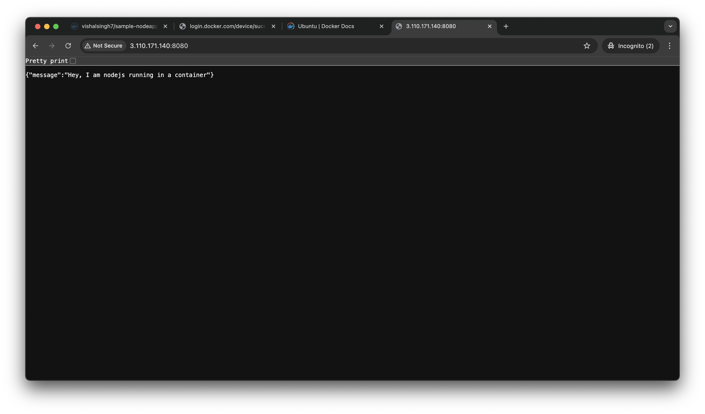

Docker is an open-source containerization platform by which you can pack your application and all its dependencies into a standardized unit called a container. Containers are light in weight which makes them portable and they are isolated from the underlying infrastructure and from each other container. You can run the docker image as a docker container in any machine where docker is installed without depending on the operating system.

### Installing Docker on Ubuntu(EC2 Instance)

#### Method 1:

##### [Install using the `apt` repository](https://docs.docker.com/engine/install/ubuntu/#install-using-the-repository)

Before you install Docker Engine for the first time on a new host machine, you need to set up the Docker `apt` repository. Afterward, you can install and update Docker from the repository.

1. Set up Docker's `apt` repository.
	```sh
	# Add Docker's official GPG key:
	sudo apt-get update
	sudo apt-get install ca-certificates curl
	sudo install -m 0755 -d /etc/apt/keyrings
	sudo curl -fsSL https://download.docker.com/linux/ubuntu/gpg -o /etc/apt/keyrings/docker.asc
	sudo chmod a+r /etc/apt/keyrings/docker.asc
	
	# Add the repository to Apt sources:
	echo \
	  "deb [arch=$(dpkg --print-architecture) signed-by=/etc/apt/keyrings/docker.asc] https://download.docker.com/linux/ubuntu \
	  $(. /etc/os-release && echo "${UBUNTU_CODENAME:-$VERSION_CODENAME}") stable" | \
	  sudo tee /etc/apt/sources.list.d/docker.list > /dev/null
	sudo apt-get update
	```


2. Install the Docker packages.
	```sh
	sudo apt-get install docker-ce docker-ce-cli containerd.io docker-buildx-plugin docker-compose-plugin
	```

3. Verify that the installation is successful by checking version of docker:

	```sh
	docker --version
	```

**Reference** 
* https://docs.docker.com/engine/install/ubuntu/


#### Method 2:

The Docker installation package available in the official Ubuntu repository may not be the latest version. To ensure we get the latest version, we’ll install Docker from the official Docker repository. To do that, we’ll add a new package source, add the GPG key from Docker to ensure the downloads are valid, and then install the package.

First, update your existing list of packages:

```sh
sudo apt update
```


Next, install a few prerequisite packages which let `apt` use packages over HTTPS:

```sh
sudo apt install apt-transport-https ca-certificates curl software-properties-common
```


Then add the GPG key for the official Docker repository to your system:

```sh
curl -fsSL https://download.docker.com/linux/ubuntu/gpg | sudo apt-key add -
```


Add the Docker repository to APT sources:

```sh
sudo add-apt-repository "deb [arch=amd64] https://download.docker.com/linux/ubuntu focal stable"
```


This will also update our package database with the Docker packages from the newly added repo.

Make sure you are about to install from the Docker repo instead of the default Ubuntu repo:

```sh
apt-cache policy docker-ce
```

You’ll see output like this, although the version number for Docker may be different:

Output of apt-cache policy docker-ce

```sh
docker-ce:
  Installed: (none)
  Candidate: 5:19.03.9~3-0~ubuntu-focal
  Version table:
     5:19.03.9~3-0~ubuntu-focal 500
        500 https://download.docker.com/linux/ubuntu focal/stable amd64 Packages
```


Notice that `docker-ce` is not installed, but the candidate for installation is from the Docker repository for Ubuntu 20.04 (`focal`).

Finally, install Docker:

```sh
sudo apt install docker-ce
```


Docker should now be installed, the daemon started, and the process enabled to start on boot. Check that it’s running:

```sh
sudo systemctl status docker
```


The output should be similar to the following, showing that the service is active and running:

```sh
Output● docker.service - Docker Application Container Engine
     Loaded: loaded (/lib/systemd/system/docker.service; enabled; vendor preset: enabled)
     Active: active (running) since Tue 2020-05-19 17:00:41 UTC; 17s ago
TriggeredBy: ● docker.socket
       Docs: https://docs.docker.com
   Main PID: 24321 (dockerd)
      Tasks: 8
     Memory: 46.4M
     CGroup: /system.slice/docker.service
             └─24321 /usr/bin/dockerd -H fd:// --containerd=/run/containerd/containerd.sock
```

Installing Docker now gives you not just the Docker service (daemon) but also the `docker` command line utility, or the Docker client. We’ll explore how to use the `docker` command later in this tutorial.

**Reference:**
* https://www.digitalocean.com/community/tutorials/how-to-install-and-use-docker-on-ubuntu-20-04


-----

### Docker Commands for Reference

##### 1. **Running Containers**

- **Run a container (e.g., Ubuntu):**
    
    ```bash
    sudo docker run -it ubuntu
    ```
    
##### 2. **Listing Containers**

- **List running containers:**
    
    ```bash
    docker container ls
    ```
    
- **List all containers (including stopped):**
    
    ```bash
    docker container ls -a
    ```
    
##### 3. **Starting and Stopping Containers**

- **Start a container:**
    
    ```bash
    docker start <container_name>
    sudo docker start romantic_roentgen
    ```
    
- **Stop a container:**
    
    ```bash
    docker stop <container_name>
    sudo docker stop romantic_roentgen
    ```
    

##### 4. **Execute Commands in Containers**

- **Execute a command inside a container:**
    
    ```bash
    sudo docker exec <container_name> <command>
    sudo docker exec romantic_roentgen ls
    ```
    
    Example output:
    
    ```bash
    ubuntu@ip-10-20-56-118:~$
    bin
    boot
    data1
    dev
    etc
    home
    lib
    lib64
    media
    mnt
    opt
    proc
    root
    run
    sbin
    srv
    sys
    tmp
    usr
    var
    ```
    
- **Execute a command inside a container without disconnecting (interactive bash session):**
    
    ```bash
    sudo docker exec -it <container_name> bash
    sudo docker exec -it romantic_roentgen bash
    ```
    
    Example output:
    
    ```bash
    root@4c3c90c2f9bf:/# 
    ```
    

##### 5. **Checking Docker Images**

- **List available Docker images:**
    
    ```bash
    docker images
    sudo docker images
    ```
    
    Example output:
    
    ```bash
    REPOSITORY   TAG       IMAGE ID       CREATED       SIZE
    ubuntu       latest    a04dc4851cbc   2 weeks ago   78.1MB
    ```
    

##### 6. **Running Node Docker Image**

- **Run a Node.js container:**
    
    ```bash
    sudo docker run -it node
    ```
    
    Output:
    
    ```bash
    Welcome to Node.js v23.7.0.
    Type ".help" for more information.
    > console.log("Hello World")
    Hello World
    undefined
    ```
    

##### 7. **Port Mapping**

- **Run Mailhog with port mapping:**
    
    ```bash
    docker pull mailhog/mailhog
    docker run -d -p 8025:8025 -p 1025:1025 mailhog/mailhog
    ```
    
- **Run Jenkins with port mapping:**
    
    ```bash
    sudo docker run -p 8080:8080 jenkins/jenkins
    ```
    
- **Run Nginx with port mapping:**
    
    ```bash
    sudo docker run -p 8080:80 nginx
    ```
    

##### 8. **Environment Variables**

- **Pass environment variables:**
    
    ```bash
    docker run -it -p 8080:80 -e key=value -e key=value nginx
    ```
    

##### 9. **Build a Docker Image from a Dockerfile**

- **Build an image from a Dockerfile:**
    
    ```bash
    docker build -t <docker-image-name> <Dockerfile-Directory>
    docker build -t sample-nodeapp .
    ```
    

##### 10. **Accessing a Running Container**

- **Enter an interactive shell in a running container:**
    
    ```bash
    docker exec -it <docker-container-id> bash
    sudo docker exec -it 7f7fb058daec bash
    ```
    
    Example output:
    
    ```bash
    root@7f7fb058daec:/# ls
    bin   dev  home  lib64    media  node_modules  package-lock.json  proc  run   srv  tmp  var
    boot  etc  lib   main.js  mnt    opt           package.json       root  sbin  sys  usr
    root@7f7fb058daec:/# cat main.js
    const express = require('express');
    const app = express();
    
    const PORT = process.env.PORT || 8000;
    
    app.get('/', (req, res) => {
        return res.json({ message: "Hey, I am nodejs running in a container"});
    });
    
    app.listen(PORT, () => {
        console.log(`Server is running on PORT: ${PORT}`);
    });
    ```
    

##### 11. **Running Containers with Port Mapping**

- **Run container with specific port mapping and environment variables:**
    
    ```bash
    docker run -it -e PORT=4000 -p 4000:4000 <docker-image-name>
    sudo docker run -it -e PORT=4000 -p 4000:4000 sample-nodeapp
    ```
    
    Example output:
    
    ```bash
    Server is running on PORT: 4000
    ```
    
- **Another example with different port:**
    
    ```bash
    sudo docker run -it -e PORT=8080 -p 8080:8080 vishalsingh7/sample-nodeapp
    Server is running on PORT: 8080
    ```
    



##### 12. **Remove a Docker Image and Container**

* **Container:**
	* Remove one container
		```sh
		 sudo docker container rm <container-id>
		```
	*  Remove all containers
		```sh
		sudo docker container rm $(sudo docker container ls -a -q)
		```

* **Image:**
	* Remove one image
		```sh
		 sudo docker rmi <image-id>
		```
	*  Remove all images
		```sh
		sudo docker rmi $(sudo docker images -q)
```


### Docker Compose Example for Multiple Services

A `docker-compose.yml` file helps define and manage multi-container Docker applications.

```yaml
version: "3.8"

services:
  postgres:
    image: postgres # PostgreSQL from Docker Hub
    ports:
      - "5432:5432" # Map container port 5432 to host port 5432
    environment:
      POSTGRES_USER: postgres
      POSTGRES_DB: review
      POSTGRES_PASSWORD: password

  redis:
    image: redis # Redis from Docker Hub
    ports:
      - "6379:6379" # Map container port 6379 to host port 6379
```

##### Commands for Running Docker Compose

- **Start all services defined in the `docker-compose.yml` file:**
    
    ```bash
    docker compose up
    ```
    
- **Start services in the background (detached mode):**
    
    ```bash
    docker compose up -d
    ```
    
- **Stop all services:**
    
    ```bash
    docker compose down
    ```
    

---

#### Example of a Simple Node.js Application


A basic Express app that listens on a specified port and responds with a message.

**main.js**
```js
const express = require('express');
const app = express();

const PORT = process.env.PORT || 8000;

app.get('/', (req, res) => {
    return res.json({ message: "Hey, I am nodejs running in a container" });
});

app.listen(PORT, () => {
    console.log(`Server is running on PORT: ${PORT}`);
});
```


#### Dockerfile for Node.js Application

A `Dockerfile` defines the environment setup for the container, including necessary packages, copying application files, and executing commands.

```Dockerfile
FROM ubuntu

# Update and install required packages
RUN apt-get update
RUN apt-get install -y curl

# Install Node.js (version 18.x in this case)
RUN curl -sL https://deb.nodesource.com/setup_18.x | bash -
RUN apt-get upgrade -y
RUN apt-get install -y nodejs

# Copy necessary files from the local machine to the container
COPY package.json package.json
COPY package-lock.json package-lock.json
COPY main.js main.js

# Install dependencies
RUN npm install

# Set the entrypoint to start the app when the container runs
ENTRYPOINT [ "node", "main.js" ]
```


**Explanation of the Dockerfile Steps:**

1. **FROM ubuntu**: Base image is Ubuntu.
2. **RUN apt-get update**: Update the package lists for the system.
3. **RUN apt-get install -y curl**: Install `curl`, a utility used for downloading resources.
4. **RUN curl -sL [https://deb.nodesource.com/setup_18.x](https://deb.nodesource.com/setup_18.x) | bash -**: Setup Node.js repository for version 18.x.
5. **RUN apt-get upgrade -y && apt-get install -y nodejs**: Install Node.js.
6. **COPY**: Copy the `package.json`, `package-lock.json`, and `main.js` to the container.
7. **RUN npm install**: Install dependencies defined in `package.json`.
8. **ENTRYPOINT ["node", "main.js"]**: Set the entry point to run the Node.js application when the container starts.


##### Docker Compose + Docker file Workflow

1. **Build Docker Images**: The `docker-compose.yml` file will use the **Postgres** and **Redis** images, while the `Dockerfile` defines the custom image for the Node.js application.
    
2. **Running Containers with Docker Compose**: Use the `docker compose up -d` command to spin up the entire stack in the background, which includes your Postgres database, Redis, and Node.js application.
    
3. **Communicating Between Services**:
    
    - The **Node.js app** can communicate with **Postgres** and **Redis** via the defined ports (`5432` for Postgres, `6379` for Redis).
    - You can define additional environment variables and networking in `docker-compose.yml` if needed.


#### Quick Reference for Docker Compose Commands

- **Start services**:
    
    ```bash
    docker compose up
    ```
    
- **Start services in the background (detached mode)**:
    
    ```bash
    docker compose up -d
    ```
    
- **Stop services**:
    
    ```bash
    docker compose down
    ```
    


### Docker Networking

Container networking refers to the ability for containers to connect to and communicate with each other, or to non-Docker workloads.

Containers have networking enabled by default, and they can make outgoing connections. A container has no information about what kind of network it's attached to, or whether their peers are also Docker workloads or not. A container only sees a network interface with an IP address, a gateway, a routing table, DNS services, and other networking details. That is, unless the container uses the `none` network driver.

|Driver|Description|
|---|---|
|`bridge`|The default network driver.|
|`host`|Remove network isolation between the container and the Docker host.|
|`none`|Completely isolate a container from the host and other containers.|
|`overlay`|Overlay networks connect multiple Docker daemons together.|
|`ipvlan`|IPvlan networks provide full control over both IPv4 and IPv6 addressing.|
|`macvlan`|Assign a MAC address to a container.|

#### Network drivers

Docker's networking subsystem is pluggable, using drivers. Several drivers exist by default, and provide core networking functionality:

- `bridge`: The default network driver. If you don't specify a driver, this is the type of network you are creating. Bridge networks are commonly used when your application runs in a container that needs to communicate with other containers on the same host. See [Bridge network driver](https://docs.docker.com/engine/network/drivers/bridge/).
    
- `host`: Remove network isolation between the container and the Docker host, and use the host's networking directly. See [Host network driver](https://docs.docker.com/engine/network/drivers/host/).
    
- `overlay`: Overlay networks connect multiple Docker daemons together and enable Swarm services and containers to communicate across nodes. This strategy removes the need to do OS-level routing. See [Overlay network driver](https://docs.docker.com/engine/network/drivers/overlay/).
    
- `ipvlan`: IPvlan networks give users total control over both IPv4 and IPv6 addressing. The VLAN driver builds on top of that in giving operators complete control of layer 2 VLAN tagging and even IPvlan L3 routing for users interested in underlay network integration. See [IPvlan network driver](https://docs.docker.com/engine/network/drivers/ipvlan/).
    
- `macvlan`: Macvlan networks allow you to assign a MAC address to a container, making it appear as a physical device on your network. The Docker daemon routes traffic to containers by their MAC addresses. Using the `macvlan` driver is sometimes the best choice when dealing with legacy applications that expect to be directly connected to the physical network, rather than routed through the Docker host's network stack. See [Macvlan network driver](https://docs.docker.com/engine/network/drivers/macvlan/).
    
- `none`: Completely isolate a container from the host and other containers. `none` is not available for Swarm services. See [None network driver](https://docs.docker.com/engine/network/drivers/none/).
    
- [Network plugins](https://docs.docker.com/engine/extend/plugins_network/): You can install and use third-party network plugins with Docker.


##### 1. **Inspecting Bridge Network**

To check details about the default bridge network, use the following command:

```bash
sudo docker network inspect bridge
```

This will show detailed information about the bridge network, such as:

- **Network ID** and **Name** (`bridge`)
- **Subnet** and **Gateway**
- **Connected containers** (Under `Containers` section)

Example output showing a container connected to the bridge network:

```json
[
    {
        "Name": "bridge",
        "Id": "4f2eeb0fd86da1bb29a4aabf8c713797f472941467a80e472803337b627720af",
        "Created": "2025-02-14T05:28:14.886752454Z",
        "Scope": "local",
        "Driver": "bridge",
        "EnableIPv6": false,
        "IPAM": {
            "Driver": "default",
            "Options": null,
            "Config": [
                {
                    "Subnet": "172.17.0.0/16",
                    "Gateway": "172.17.0.1"
                }
            ]
        },
        "Internal": false,
        "Attachable": false,
        "Ingress": false,
        "ConfigFrom": {
            "Network": ""
        },
        "ConfigOnly": false,
        "Containers": {
            "982a4b9995d9af29d60c49c8e9e4e679d5fa84b7f7b01c870756bfa804d62379": {
                "Name": "youthful_noyce",
                "EndpointID": "d3c85a9430d6a157242ff12ded8b9b448b9fab93a1bd0af05e96ddbfbaac0fa7",
                "MacAddress": "02:42:ac:11:00:02",
                "IPv4Address": "172.17.0.2/16",
                "IPv6Address": ""
            }
        },
        "Options": {
            "com.docker.network.bridge.default_bridge": "true",
            "com.docker.network.bridge.enable_icc": "true",
            "com.docker.network.bridge.enable_ip_masquerade": "true",
            "com.docker.network.bridge.host_binding_ipv4": "0.0.0.0",
            "com.docker.network.bridge.name": "docker0",
            "com.docker.network.driver.mtu": "1500"
        },
        "Labels": {}
    }
]
```

The above output shows that the container named **youthful_noyce** is connected to the bridge network with the IP address **172.17.0.2**.

##### 2. **Listing All Networks**

To see a list of all networks, use:

```bash
sudo docker network ls
```

This will show all Docker networks, including:

- **bridge** (default network)
- **host** (host network)
- **none** (no network)
- Custom networks (user-defined networks)

Example output:

```bash
NETWORK ID     NAME                  DRIVER    SCOPE
4f2eeb0fd86d   bridge                bridge    local
37a87e18edaf   docker-node_default   bridge    local
07a329bf0fae   host                  host      local
2bb17eef3898   none                  null      local
```

##### 3. **Changing Network for a Container**

To run a container on a specific network, use the `--network` flag:

- **Using host network**:
    
    ```bash
    docker run -it --network=host busybox
    ```
    
- **Using none network** (isolated from all networks):
    
    ```bash
    sudo docker run -it --network=none busybox
    ```
    

##### 4. **Creating a Custom User-Defined Network**

You can create custom, user-defined networks, and connect multiple containers to the same network. Once connected to a user-defined network, containers can communicate with each other using container IP addresses or container names.

The following example creates a network using the `bridge` network driver and running a container in the created network:

```sh
$ docker network create -d bridge my-net
$ docker run --network=my-net -itd --name=container3 busybox
```


To create a new network:

```bash
sudo docker network create -d bridge new-network
```

Once the network is created, verify it with:

```bash
sudo docker network ls
```

The new network **new-network** should appear in the list.

Example:

```bash
NETWORK ID     NAME                  DRIVER    SCOPE
4f2eeb0fd86d   bridge                bridge    local
37a87e18edaf   docker-node_default   bridge    local
07a329bf0fae   host                  host      local
7a28a3f0e205   new-network           bridge    local
2bb17eef3898   none                  null      local
```

##### 5. **Running Containers on the Custom Network**

To run a container on the custom network:

```bash
sudo docker run -it --network=new-network --name first_container ubuntu
```

To run a second container on the same network:

```bash
sudo docker run -it --network=new-network --name second_container busybox
```

##### 6. **Ping Between Containers in the Same Network**

Once both containers are running on the same custom network, they can communicate with each other using their names or IP addresses.

For example, from **second_container**, you can ping **first_container**:

```bash
ping first_container
```

Example output:

```bash
PING first_container (172.19.0.2): 56 data bytes
64 bytes from 172.19.0.2: seq=0 ttl=64 time=0.225 ms
64 bytes from 172.19.0.2: seq=1 ttl=64 time=0.071 ms
64 bytes from 172.19.0.2: seq=2 ttl=64 time=0.058 ms
64 bytes from 172.19.0.2: seq=3 ttl=64 time=0.075 ms
64 bytes from 172.19.0.2: seq=4 ttl=64 time=0.067 ms
```

#### 7. **Checking Containers Attached to a Custom Network**

To check the containers connected to a custom network:

```bash
sudo docker network inspect new-network
```

Example output shows containers attached to **new-network**:

```json
[
    {
        "Name": "new-network",
        "Id": "7a28a3f0e2052448be5e029ffb895104552a8dd36394ffe769fa500e94499776",
        "Created": "2025-02-14T08:06:50.513054753Z",
        "Scope": "local",
        "Driver": "bridge",
        "EnableIPv6": false,
        "IPAM": {
            "Driver": "default",
            "Options": {},
            "Config": [
                {
                    "Subnet": "172.19.0.0/16",
                    "Gateway": "172.19.0.1"
                }
            ]
        },
        "Internal": false,
        "Attachable": false,
        "Ingress": false,
        "ConfigFrom": {
            "Network": ""
        },
        "ConfigOnly": false,
        "Containers": {
            "ac13767ad59b4a540d5b5d0cd54d5897ce11eca46905d4b3e4a9200fb0895244": {
                "Name": "second_container",
                "EndpointID": "b01ac234cdcba4b7ce70397a270402e2df52bfd03e94a4b07181035a61146fae",
                "MacAddress": "02:42:ac:13:00:03",
                "IPv4Address": "172.19.0.3/16",
                "IPv6Address": ""
            },
            "e8f92ea971f59887cffcea1d755053d3facb34abf2f353f6123ddbdfca11c085": {
                "Name": "first_container",
                "EndpointID": "cd2869d05f709d99bb154fdc00594f4cec083920216ada7bd2faa7f4b1e1c0b9",
                "MacAddress": "02:42:ac:13:00:02",
                "IPv4Address": "172.19.0.2/16",
                "IPv6Address": ""
            }
        },
        "Options": {},
        "Labels": {}
    }
]
```

Here, **first_container** has the IP address **172.19.0.2** and **second_container** has the IP address **172.19.0.3**.

**Reference:**
* https://docs.docker.com/engine/network/

### Docker Volume

By default all files created inside a container are stored on a writable container layer that sits on top of the read-only, immutable image layers.

Data written to the container layer doesn't persist when the container is destroyed. This means that it can be difficult to get the data out of the container if another process needs it.

The writable layer is unique per container. You can't easily extract the data from the writeable layer to the host, or to another container.


#### Storage mount options

Docker supports the following types of storage mounts for storing data outside of the writable layer of the container:

- [Volume mounts](https://docs.docker.com/engine/storage/#volume-mounts)
- [Bind mounts](https://docs.docker.com/engine/storage/#bind-mounts)
- [tmpfs mounts](https://docs.docker.com/engine/storage/#tmpfs-mounts)
- [Named pipes](https://docs.docker.com/engine/storage/#named-pipes)

No matter which type of mount you choose to use, the data looks the same from within the container. It is exposed as either a directory or an individual file in the container's filesystem.

* **Volume mounts:**
	* Volumes are persistent storage mechanisms managed by the Docker daemon. They retain data even after the containers using them are removed. Volume data is stored on the filesystem on the host, but in order to interact with the data in the volume, you must mount the volume to a container. Directly accessing or interacting with the volume data is unsupported, undefined behavior, and may result in the volume or its data breaking in unexpected ways.
	* Volumes are ideal for performance-critical data processing and long-term storage needs. Since the storage location is managed on the daemon host, volumes provide the same raw file performance as accessing the host filesystem directly.

* **Bind mounts:**
	* Bind mounts create a direct link between a host system path and a container, allowing access to files or directories stored anywhere on the host. Since they aren't isolated by Docker, both non-Docker processes on the host and container processes can modify the mounted files simultaneously.
	* Use bind mounts when you need to be able to access files from both the container and the host.

* **tmpfs mounts:**
	* A tmpfs mount stores files directly in the host machine's memory, ensuring the data is not written to disk. This storage is ephemeral: the data is lost when the container is stopped or restarted, or when the host is rebooted. tmpfs mounts do not persist data either on the Docker host or within the container's filesystem.
	* These mounts are suitable for scenarios requiring temporary, in-memory storage, such as caching intermediate data, handling sensitive information like credentials, or reducing disk I/O. Use tmpfs mounts only when the data does not need to persist beyond the current container session.

* **Named pipes:**
	* [Named pipes](https://docs.microsoft.com/en-us/windows/desktop/ipc/named-pipes) can be used for communication between the Docker host and a container. Common use case is to run a third-party tool inside of a container and connect to the Docker Engine API using a named pipe.


#### Mounting a Host Folder to a Docker Container

##### 1. **Creating a Folder in the Local Machine**

You begin by creating a folder on your local machine, which you want to mount to a Docker container.

```bash
sudo mkdir test-folder  # Create a folder on the local machine
ls -ltr  # List files and folders to confirm the creation
```

Output:

```bash
ubuntu@ip-10-20-56-118:/$ sudo mkdir test-folder
ubuntu@ip-10-20-56-118:/$ ls -ltr
total 84
drwxr-xr-x   2 root root  4096 Feb 26  2024 bin.usr-is-merged
drwxr-xr-x   2 root root  4096 Mar 31  2024 sbin.usr-is-merged
drwxr-xr-x   2 root root  4096 Apr  8  2024 lib.usr-is-merged
lrwxrwxrwx   1 root root     8 Apr 22  2024 sbin -> usr/sbin
lrwxrwxrwx   1 root root     9 Apr 22  2024 lib64 -> usr/lib64
lrwxrwxrwx   1 root root     7 Apr 22  2024 lib -> usr/lib
lrwxrwxrwx   1 root root     7 Apr 22  2024 bin -> usr/bin
drwxr-xr-x   2 root root  4096 Jan 15 08:40 mnt
drwxr-xr-x   2 root root  4096 Jan 15 08:40 srv
drwxr-xr-x   2 root root  4096 Jan 15 08:40 media
drwxr-xr-x  12 root root  4096 Jan 15 08:40 usr
drwx------   2 root root 16384 Jan 15 08:43 lost+found
drwxr-xr-x   6 root root  4096 Jan 15 08:46 snap
drwxr-xr-x   5 root root  4096 Jan 15 08:46 boot
drwxr-xr-x  13 root root  4096 Feb 12 10:52 var
drwxr-xr-x   3 root root  4096 Feb 12 10:52 home
drwxr-xr-x   3 root root  4096 Feb 12 11:15 opt
drwxr-xr-x 115 root root  4096 Feb 13 09:34 etc
drwx------   6 root root  4096 Feb 13 09:59 root
drwxr-xr-x   3 root root  4096 Feb 13 09:59 docker-node
dr-xr-xr-x 194 root root     0 Feb 14 05:28 proc
dr-xr-xr-x  13 root root     0 Feb 14 05:28 sys
drwxr-xr-x  16 root root  3300 Feb 14 05:28 dev
drwxr-xr-x  31 root root  1000 Feb 14 08:13 run
drwxr-xr-x   2 root root  4096 Feb 14 08:33 test-folder
drwxrwxrwt  12 root root  4096 Feb 14 08:35 tmp

ubuntu@ip-10-20-56-118:/$ cd test-folder/
ubuntu@ip-10-20-56-118:/test-folder$ pwd
/test-folder
ubuntu@ip-10-20-56-118:/test-folder$ ls
ubuntu@ip-10-20-56-118:/test-folder$ 
```

###### Navigate to the folder:

```bash
cd test-folder/  # Go into the folder
ls  # Confirm it's empty
```

Output:

```bash
ubuntu@ip-10-20-56-118:/test-folder$ ls  # Folder is empty
```

##### 2. **Mounting the Folder into a Docker Container**

To mount the folder from your local machine into a Docker container, use the `-v` option when running the container.

```bash
sudo docker run -it -v /test-folder:/home/ubuntu/container-abc ubuntu
```

- **Explanation**: The `-v` flag mounts the local folder `/test-folder` to `/home/ubuntu/container-abc` inside the container.

###### Inside the container:

```bash
ls  # Check the container's root directory
cd home/ubuntu/  # Navigate to the home directory
ls  # List the contents to find the mounted folder
cd container-abc/  # Enter the mounted folder
touch index.js  # Create a new file in the mounted folder
ls  # Confirm the file exists
```

Output:

```bash
root@292e62040175:/# ls  # List root folder, see standard directories
root@292e62040175:/# cd home/ubuntu/  # Navigate to the 'ubuntu' directory
root@292e62040175:/home/ubuntu# ls  # Confirm 'container-abc' folder is there
container-abc
root@292e62040175:/home/ubuntu# cd container-abc/  # Go to mounted folder
root@292e62040175:/home/ubuntu/container-abc# touch index.js  # Create 'index.js' file
root@292e62040175:/home/ubuntu/container-abc# ls  # List contents to confirm 'index.js'
index.js
```

###### Checking the Local Machine:

After creating the file inside the container, check whether it's visible on the local machine as well.

```bash
ls /test-folder  # List contents of the local folder
```

Output:

```bash
index.js  # Confirm the file is created on the local machine as well
```

##### 3. **Checking the Persistence of Data Across Containers**

If you mount the same folder into a different container, the changes made in one container should still be visible in the other.

```bash
sudo docker run -it -v /test-folder:/home/new-folder busybox
```

Inside the second container, you can check the folder:

```bash
ls  # Check root directory
cd home  # Navigate to home directory
ls  # Find the mounted folder 'new-folder'
cd new-folder/  # Enter the mounted folder
ls  # Confirm the 'index.js' file exists
```

Output:

```bash
/ # ls  # List root folder, see standard directories
/ # cd home  # Navigate to 'home'
/home # ls  # Confirm 'new-folder' folder is there
/home # cd new-folder/  # Enter 'new-folder'
/home/new-folder # ls  # Confirm 'index.js' file is there
index.js
```

#### Create and manage volumes

Unlike a bind mount, you can create and manage volumes outside the scope of any container.

**Create a volume:**
```console
$ docker volume create my-vol
```

```console
ubuntu@ip-10-20-56-118:~$ sudo docker volume create my-vol
my-vol
```


**List volumes:**
```console
$ docker volume ls

local               my-vol
```
``
```
ubuntu@ip-10-20-56-118:~$ sudo docker volume ls
DRIVER    VOLUME NAME
local     8e3a984db35d89fe3143c60f0e19f723c24e5602323010fb77a94dadd4247589
local     66b02ce092cc1707b6362da32ce440383b5cec9f5dd4b769e8d3cca2583e15d6
local     my-vol

```


**Inspect a volume:**
```console
$ docker volume inspect my-vol
[
    {
        "Driver": "local",
        "Labels": {},
        "Mountpoint": "/var/lib/docker/volumes/my-vol/_data",
        "Name": "my-vol",
        "Options": {},
        "Scope": "local"
    }
]
```

**Remove a volume:**
```console
$ docker volume rm my-vol
```


####  Start a container with a volume

If you start a container with a volume that doesn't yet exist, Docker creates the volume for you. The following example mounts the volume `myvol2` into `/app/` in the container.

The following `-v` and `--mount` examples produce the same result. You can't run them both unless you remove the `devtest` container and the `myvol2` volume after running the first one.

**`--mount`**
```sh
$ docker run -d --name devtest --mount source=myvol2,target=/app nginx:latest
```

```sh
ubuntu@ip-10-20-56-118:~$ docker run -d --name devtest --mount source=my-vol,target=/app -p 80:80 nginx:latest
docker: permission denied while trying to connect to the Docker daemon socket at unix:///var/run/docker.sock: Head "http://%2Fvar%2Frun%2Fdocker.sock/_ping": dial unix /var/run/docker.sock: connect: permission denied.
See 'docker run --help'.
ubuntu@ip-10-20-56-118:~$ sudo docker run -d --name devtest --mount source=my-vol,target=/app -p 80:80 nginx:latest
Unable to find image 'nginx:latest' locally
latest: Pulling from library/nginx
c29f5b76f736: Already exists 
e19db8451adb: Pull complete 
24ff42a0d907: Pull complete 
c558df217949: Pull complete 
976e8f6b25dd: Pull complete 
6c78b0ba1a32: Pull complete 
84cade77a831: Pull complete 
Digest: sha256:91734281c0ebfc6f1aea979cffeed5079cfe786228a71cc6f1f46a228cde6e34
Status: Downloaded newer image for nginx:latest
491e5cc758624a5b165ce33b211e1b6eaa2ba0480dd38f5b01a023d56120ebfb
```


**`-v`**
```sh
$ docker run -d --name devtest -v myvol2:/app nginx:latest
```

Use `docker inspect devtest` to verify that Docker created the volume and it mounted correctly. Look for the `Mounts` section:

```json
"Mounts": [
    {
        "Type": "volume",
        "Name": "myvol2",
        "Source": "/var/lib/docker/volumes/myvol2/_data",
        "Destination": "/app",
        "Driver": "local",
        "Mode": "",
        "RW": true,
        "Propagation": ""
    }
],
```

This shows that the mount is a volume, it shows the correct source and destination, and that the mount is read-write.

Stop the container and remove the volume. Note volume removal is a separate step.

```sh
$ docker container stop devtest

$ docker container rm devtest

$ docker volume rm myvol2
```


**Reference:**
* https://docs.docker.com/engine/storage/
* https://docs.docker.com/engine/storage/volumes/


### Optimizing Docker file for Better Performance and Maintenance

#### **Before Optimization:**
```dockerfile
FROM ubuntu

RUN apt-get update
RUN apt-get install -y curl
RUN curl -sL https://deb.nodesource.com/setup_18.x | bash -
RUN apt-get upgrade -y
RUN apt-get install -y nodejs

COPY package.json package.json
COPY package-lock.json package-lock.json
COPY main.js main.js

RUN npm install

ENTRYPOINT [ "node", "main.js" ]
```

##### Issues with the 'Before' Dockerfile:

1. **Multiple `RUN` Instructions**:
    - Each `RUN` command creates a new layer in the Docker image, increasing the final image size and build time.
    - Redundant `apt-get update` and package installations that can be combined.
    
2. **Lack of a Defined Working Directory**:
    - Without a `WORKDIR`, files may not be copied to the intended location inside the container, potentially leading to confusion when managing paths.

3. **Copying Files Individually**:
    - Each file is copied individually (`package.json`, `package-lock.json`, `main.js`), which can make the Dockerfile unnecessarily verbose and increase build time.

#### **After Optimisation:**

```dockerfile
FROM ubuntu

RUN apt-get update
RUN apt-get install -y curl
RUN curl -sL https://deb.nodesource.com/setup_18.x | bash -
RUN apt-get upgrade -y
RUN apt-get install -y nodejs

WORKDIR /app

COPY package.json package.json
COPY package-lock.json package-lock.json

RUN npm install

COPY . .

ENTRYPOINT [ "node", "main.js" ]
```

##### Changes and Improvements in the 'After' Dockerfile:

1. **Using `WORKDIR`**:
    - The `WORKDIR` instruction sets the working directory inside the container to `/app`. This provides a consistent environment for running commands like `npm install` and ensures that files are copied to the correct location.
    - If the directory doesn't exist, it is created automatically.
    
    ```dockerfile
    WORKDIR /app
    ```
    
2. **Combining `COPY` Commands**:
    - Instead of copying files individually, the optimized Dockerfile copies all the necessary files (`package.json`, `package-lock.json`, and other files) in a more efficient manner.
    - The `COPY . .` command copies everything from the current context (local directory) to the working directory inside the container (`/app`). This reduces the number of `COPY` instructions and keeps the Dockerfile more concise.
    
    ```dockerfile
    COPY . .
    ```
    
3. **Reducing Layers with Combined `RUN` Commands**:
    - The optimization doesn’t explicitly combine the `RUN` commands in the given `After` version, but it’s a good practice to combine `RUN` commands when possible to reduce the number of layers and improve build performance.
    
		A more optimal version would look like this:
	    ```dockerfile
	    RUN apt-get update && apt-get install -y curl nodejs && \
        curl -sL https://deb.nodesource.com/setup_18.x | bash -
	    ```
    
    **Explanation**: Combining multiple commands into a single `RUN` reduces the number of layers and streamlines the process.
    
4. **Improved Build Caching**:
    - By copying `package.json` and `package-lock.json` first, and running `npm install` separately, we ensure that Docker caches the results of `npm install` (unless those files change). This prevents `npm install` from running unnecessarily if no dependencies have changed, speeding up subsequent builds.
    
    **Order of COPY**:
    - First copy `package.json` and `package-lock.json` to take advantage of Docker's build cache for `npm install`.
    - Then copy the rest of the project files after installing dependencies.

**`.dockerignore File:`**
```dockerfile
node_modules/
```

- The `.dockerignore` file prevents the `node_modules/` directory from being copied into the Docker image, which can help avoid unnecessary bloat and issues with different environments between the host and the container.
- This file works similarly to `.gitignore`, and excluding `node_modules` ensures that only the dependencies are installed fresh during the `npm install` phase.

##### **Key Best Practices** for Dockerfile Optimization:

1. **Minimize Layers**:
    - Use `&&` to combine commands into a single `RUN` statement. Each `RUN` creates a new layer, which adds overhead to the image size and build time.
	    Example:
	    ```dockerfile
	    RUN apt-get update && apt-get install -y curl nodejs && \
        curl -sL https://deb.nodesource.com/setup_18.x | bash -
	    ```
    
2. **Leverage Docker Build Cache**:
    - Copy `package.json` and `package-lock.json` first, followed by running `npm install`. This allows Docker to cache the dependencies unless the package files change, speeding up subsequent builds.
    
3. **Use `.dockerignore`**:
    - Just like `.gitignore`, the `.dockerignore` file excludes unnecessary files and directories (e.g., `node_modules/`, test folders) from being copied into the Docker image. This keeps the image size smaller and avoids copying files that are not needed.

4. **Set Working Directory with `WORKDIR`**:
    - Always set a `WORKDIR` in your Dockerfile to ensure the right directory context when executing commands and copying files.

5. **Copying Files Efficiently**:
    - Instead of copying files individually, copy entire directories or use a single `COPY . .` when appropriate. This minimizes Docker file complexity and improves maintainability.

#### Final Optimized Docker file Summary:

```dockerfile
FROM ubuntu

RUN apt-get update && apt-get install -y curl nodejs && \
    curl -sL https://deb.nodesource.com/setup_18.x | bash - && \
    apt-get upgrade -y

WORKDIR /app

COPY package.json package-lock.json ./

RUN npm install

COPY . .

ENTRYPOINT [ "node", "main.js" ]
```

### Multi-stage builds

Multi-stage builds are useful to anyone who has struggled to optimize Dockerfiles while keeping them easy to read and maintain.

Multi-stage builds in Docker allow you to optimize Dockerfiles by separating the build environment from the final runtime environment. This approach helps minimize the size of your images and improves build times. By using multiple `FROM` statements, you can copy over only what’s necessary from one stage to another, avoiding unnecessary dependencies in the final image.

#### Key Benefits:

- **Smaller final image size**: Only the necessary files and dependencies are copied over to the final image, making it leaner.
- **Separation of concerns**: It separates the building and runtime environments, which keeps your Dockerfile cleaner and easier to maintain.
- **Improved security**: Sensitive build tools or libraries are not included in the production image.

#### Example Breakdown:

##### 1. **Build Stage:**

The `build` stage is where we prepare everything required for building the application, such as dependencies and compilation tools.

```Dockerfile
FROM ubuntu as build
```

- **`FROM ubuntu as build`**: This starts the `build` stage based on an `ubuntu` image. `as build` tags this stage so we can reference it later.

	```Dockerfile
	RUN apt-get update
	RUN apt-get install -y curl
	RUN curl -sL https://deb.nodesource.com/setup_18.x | bash -
	RUN apt-get upgrade -y
	RUN apt-get install -y nodejs
	RUN apt-get install typescript
	```

- **Install Dependencies**: These lines install `curl`, `nodejs`, and `typescript` into the build environment. It’s important to update the package list and upgrade to the latest versions of libraries to ensure compatibility.

	```Dockerfile
	WORKDIR /app
	```

- **Set Working Directory**: The `WORKDIR` sets the working directory for any subsequent commands, ensuring that all paths are relative to `/app`.

	```Dockerfile
	COPY package.json package.json
	COPY package-lock.json package-lock.json
	```

- **Copy Project Files**: These lines copy your `package.json` and `package-lock.json` to the container. This allows us to install the Node.js dependencies.

	```Dockerfile
	RUN npm install
	RUN tsc -p .    # build
	```

- **Install Node.js Dependencies & Build**: `npm install` installs the required packages. `tsc -p .` compiles TypeScript files into JavaScript files.

##### 2. **Runner Stage:**

The `runner` stage is where the actual application will run. It’s based on the `node` image, which is a lightweight image that contains only Node.js and its necessary dependencies, making it optimal for production use.

```Dockerfile
FROM node as runner
```

- **`FROM node as runner`**: Starts a new stage using the `node` image, which is lightweight and suitable for running Node.js applications in production.

	```Dockerfile
	WORKDIR app/
	```

- **Set Working Directory**: The `WORKDIR` here specifies that the `app` directory will be used to run the application.

	```Dockerfile
	COPY --from=build app/ .
	```

- **Copy from Build Stage**: This copies the application files from the `build` stage (`app/`) to the current working directory in the `runner` stage. Only the necessary files (e.g., compiled `main.js`) are copied.

##### 3. **Finalizing with ENTRYPOINT:**

```Dockerfile
ENTRYPOINT [ "node", "main.js" ]
```

- **Set Entry Point**: This sets the command to run the application when the container starts. It tells Docker to run the `node` command with the `main.js` file as the entry point.


	```dockerfile
	FROM ubuntu as build
	
	RUN apt-get update
	RUN apt-get install -y curl
	RUN curl -sL https://deb.nodesource.com/setup_18.x | bash -
	RUN apt-get upgrade -y
	RUN apt-get install -y nodejs
	RUN apt-get install typescript
	
	WORKDIR /app
	
	COPY package.json package.json
	COPY package-lock.json package-lock.json
	
	
	RUN npm install
	RUN tsc -p .    # build
	
	
	FROM node as runner
	
	WORKDIR app/ 
	
	COPY --from=build app/ .
	
	ENTRYPOINT [ "node", "main.js" ]
	```

##### Summary of Multi-Stage Build Structure:

1. **First Stage (Build)**:
    - Uses a base image (Ubuntu) for compiling or preparing the application.
    - Installs dependencies, copies necessary files, and compiles the code.
2. **Second Stage (Runner)**:
    - Uses a different base image (Node.js) optimized for running the app.
    - Copies only the required files from the build stage to reduce image size and dependencies.

#### Best Practices:

- **Optimize Image Size**: Always aim to copy only what is needed in the final image.
- **Minimize Layers**: Reduce the number of `RUN` commands by combining them whenever possible.
- **Use Lighter Base Images**: For production images, use smaller base images such as `node` or `alpine`.
- **Keep Build and Runtime Separate**: Never include unnecessary build tools or dependencies in the production image.