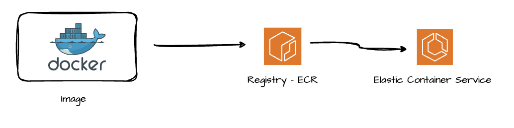

**Copy Code from Local Machine to EC2 Instance**

```sh
scp -i Downloads/keyPair.pem -r Downloads/Docker/nodejs-docker-example ubuntu@ec2-35-154-157-7.ap-south-1.compute.amazonaws.com:/home/ubuntu/
```


**Push Command to ECR:**

- Retrieve an authentication token and authenticate your Docker client to your registry. Use the AWS CLI:

	```sh
	aws ecr get-login-password --region ap-south-1 | docker login --username AWS --password-stdin 108333147495.dkr.ecr.ap-south-1.amazonaws.com
	```
    
    Note: if you receive an error using the AWS CLI, make sure that you have the latest version of the AWS CLI and Docker installed.
    

- Build your Docker image using the following command. For information on building a Docker file from scratch, see the instructions [here](https://docs.aws.amazon.com/AmazonECS/latest/developerguide/docker-basics.html) . You can skip this step if your image has already been built:

	```sh
	docker build -t vishalsinghdev-server .
	```    

- After the build is completed, tag your image so you can push the image to this repository:

	```sh
	docker tag vishalsinghdev-server:latest 108333147495.dkr.ecr.ap-south-1.amazonaws.com/vishalsinghdev-server:latest
	```
    
- Run the following command to push this image to your newly created AWS repository:

	```sh
	docker push 108333147495.dkr.ecr.ap-south-1.amazonaws.com/vishalsinghdev-server:latest
	```


##### Reference:

- **Docker Playlist:**
	* Video 1: https://youtu.be/zCsbp_iBTq8?feature=shared
	* Video 2: https://youtu.be/VbuNIZIog2w?feature=shared
	* Video 3: https://youtu.be/6t2NhkRsmuA?feature=shared
* **Docker One Shot Playlist:**
	* Video 1: https://youtu.be/31k6AtW-b3Y?feature=shared
	* Video 2: https://youtu.be/xPT8mXa-sJg?feature=shared
* **Code Link:** https://github.com/piyushgarg-dev/nodejs-docker-example